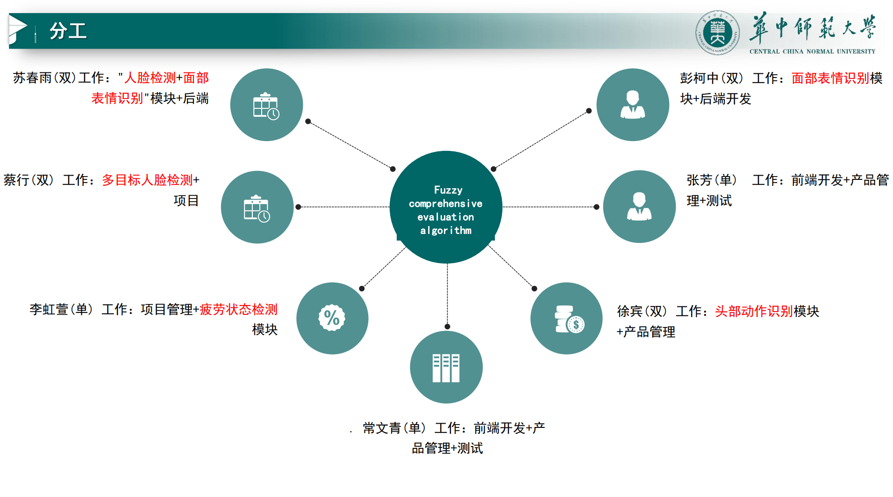

# 学生课堂表现感知系统

## 模块概述
本系统旨在通过多个模块综合评估学生在课堂上的表现。各模块分别负责不同方面的检测与评估：

- ✅**模块一**：多目标人脸检测 
- ✅**模块二**：课堂表情识别  
- ✅**模块三**：疲劳状态检测  
- **模块四**：头部姿态估计  
- **模块五**：身体倾斜度检测  
- **模块六**：使用模糊综合评价算法，结合模块二至五的数据计算学生的注意力水平

### 系统框架示意图



## 技术栈
- FastAPI
- Uvicorn

## 快速启动指南

### 安装依赖
首先，您需要安装所需的依赖包。可以通过以下命令安装：

```bash
pip install fastapi
pip install uvicorn[standard]
pip install python-multipart
```

### 启动服务
使用以下命令启动服务：

```bash
uvicorn web:app --reload
```

### 后端服务参考
[点击此处访问GoBackendOfPcsSystem GitHub仓库](https://github.com/Pokezoom/GoBackendOfPcsSystem)


---
